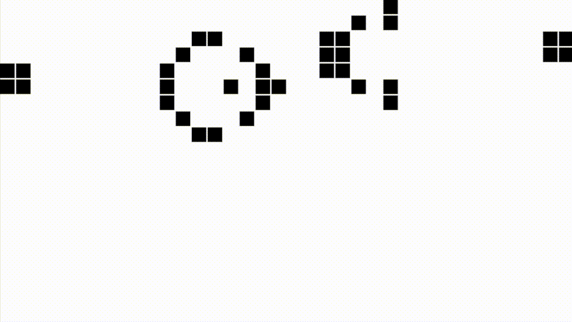

# Game of Life
This program simulates Conway's Game of Life. It is an application of the theory of cellular automata.

## Installation
This project uses C++14 and XQuartz. To create the program, navigate to the
project directory and type `make` in the terminal.

## Usage
To run the program, type `./gol` in the terminal.

## Credits
[William Kang](https://github.com/willkang7)

Window class provided by the [University of Waterloo](https://uwaterloo.ca/)

## License
[MIT](LICENSE)
